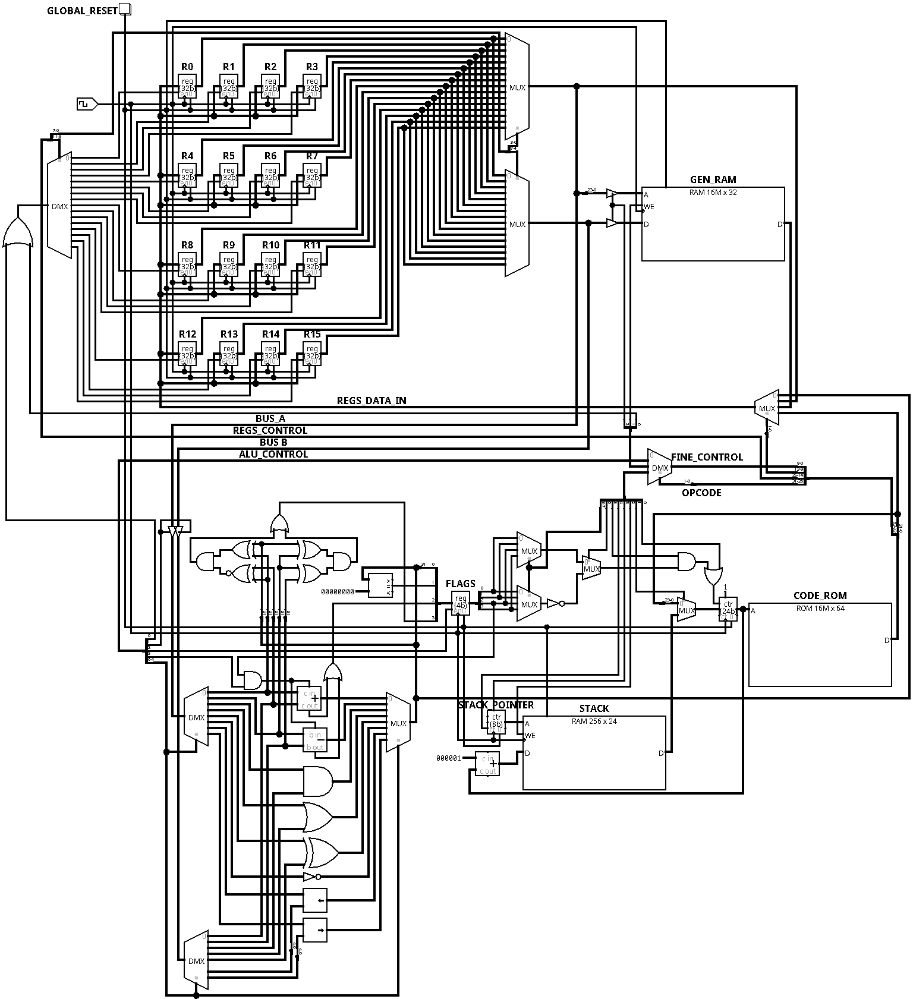

# CPU Details - Milo CPU
Versión: Alpha 0.1



## Introducción

Milo Alpha es un procesador de propósito general de 32 bits diseñado alrededor de una arquitectura de registros con unidad de control cableada. Su diseño prioriza una organización sencilla del datapath y una separación clara entre la memoria de instrucciones y la memoria de datos.

La implementación actual constituye el núcleo funcional de la arquitectura e incorpora los componentes mínimos necesarios para ejecutar instrucciones, realizar operaciones aritméticas y lógicas, y acceder a memoria mediante registros de propósito general.

Este documento describe exclusivamente la organización interna del procesador y los componentes que conforman la implementación actual.

## Especificaciones

Arquitectura: 32 bits

Banco de registros:
- 16 registros de propósito general

Program Counter:
- 24 bits

Stack Pointer:
- 24 bits de datos
- 8 bits de direcciones

Status Register:
- Flags N, Z, C y V

Unidad de control:
- Cableada (Hardwired)

Modelo de memoria:
- ROM para instrucciones (32 bits) y datos inmediatos (32 bits)
- RAM para datos (32 bits)

Buses internos: 3
- Bus A
- Bus B
- Bus C

ALU:
- ADD
- ADC
- SUB
- SBC
- AND
- OR
- XOR
- NOT
- SHL
- SHR
- CMP

Control de flujo:
- JMP
- CALL
- RET
- Saltos condicionales mediante Flags

## Organización interna

### Banco de registros

El procesador dispone de un banco formado por dieciséis registros de propósito general, cada uno con un ancho de 32 bits.

No existe diferenciación entre registros dedicados y registros de propósito general. Todos los registros poseen exactamente las mismas capacidades y pueden emplearse indistintamente como origen o destino de una operación.

El banco de registros dispone de dos puertos de lectura independientes y un puerto de escritura lo que permite obtener dos operandos simultáneamente y escribir un resultado durante el mismo ciclo de ejecución.

Cada instrucción puede seleccionar simultáneamente:

- Un registro destino.
- Un primer registro fuente.
- Un segundo registro fuente.

Durante las operaciones de acceso a memoria, dos registros pueden asumir temporalmente las funciones equivalentes a MAR (Memory Address Register) y MDR (Memory Data Register). Esta funcionalidad se implementa mediante señales de control y no requiere registros especializados, reduciendo así la complejidad del hardware y aumentando la flexibilidad de la arquitectura.

---

### ALU

La Unidad Aritmético Lógica (ALU) constituye el bloque encargado de ejecutar las operaciones aritméticas, lógicas y de comparación del procesador.

Además de generar el resultado de la operación, la ALU puede actualizar el Status Register cuando la instrucción así lo solicita mediante el modificador `.F`.

Actualmente implementa:

- ADD
- ADC
- SUB
- SBC
- AND
- OR
- XOR
- NOT
- SHL
- SHR
- CMP

Las banderas disponibles son:

- Negative (N)
- Zero (Z)
- Carry (C)
- Overflow (V)

La actualización de dichas banderas es controlada completamente por la palabra de control generada por el compilador.

---

### Status Register

El procesador incorpora un registro de estado encargado de almacenar el resultado de determinadas operaciones ejecutadas por la ALU.

Actualmente implementa cuatro banderas:

- N (Negative)
- Z (Zero)
- C (Carry)
- V (Overflow)

Estas banderas pueden actualizarse mediante las instrucciones que utilizan el modificador `.F` y posteriormente ser consultadas por las instrucciones de salto condicional.

De esta forma se desacopla el cálculo de una condición de la decisión de modificar el flujo de ejecución.

---

### Buses

El procesador utiliza una organización basada en tres buses internos que permiten desacoplar la lectura y escritura de datos durante la ejecución de una instrucción.

Esta organización permite obtener dos operandos simultáneamente y escribir un resultado en un mismo ciclo de ejecución, reduciendo la cantidad de transferencias necesarias dentro del datapath.

**Bus A:**

Transporta datos provenientes del banco de registros.

Usos:

- Primer operando de la ALU.
- MAR

**Bus B:**

- Segundo operando de la ALU.
- MDR

**Bus C:**

El resultado de la ALU o de otras fuentes es enviado mediante este bus al banco de registros.

> La utilización de tres buses permite leer simultáneamente dos operandos y escribir un resultado durante el mismo ciclo de ejecución.

---

### Unidad de Control

La unidad de control implementa una lógica cableada (Hardwired Control Unit).

Cada instrucción contiene un opcode de seis bits que identifica la operación principal a ejecutar.

El opcode es enviado a un decodificador que habilita el bloque funcional correspondiente. Posteriormente, el campo de control fino de la instrucción es distribuido mediante lógica combinacional hacia el bloque seleccionado.

Este mecanismo permite generar directamente las señales necesarias para controlar:

- Banco de registros
- ALU
- Actualización del Status Register
- Program Counter
- Stack Pointer
- Acceso a RAM
- Selección de buses
- Control de flujo

La unidad de control no emplea memoria de microcódigo ni etapas adicionales de ejecución.

---

### Sistema de memoria

- ROM
- RAM

**Organización:**

A diferencia de una organización jerárquica tradicional donde las instrucciones atraviesan múltiples niveles de memoria antes de llegar al procesador:

```text
ROM
 ↓
RAM
 ↓
CPU
```

Milo utiliza una organización de memoria dividida:

```text
             ROM
              │
              │
      Instrucciones
              │
              ▼
+---------------------------+
|           CPU             |
|                           |
| Banco de Registros        |
| ALU                       |
| Unidad de Control         |
+---------------------------+
              ▲
              │
      Datos mediante operaciones 
      LOAD/STORE + bits de control fino
              │
             RAM
```

La ROM se conecta directamente a la unidad de procesamiento y constituye la fuente de instrucciones del procesador.

La RAM se considera un recurso independiente destinado exclusivamente al almacenamiento de datos y es accedida mediante operaciones explícitas utilizando registros de propósito general.

Esta organización simplifica el datapath, reduce la lógica de control necesaria durante la búsqueda de instrucciones y desacopla completamente el flujo de instrucciones del acceso a datos.

> El Stack utilizado por CALL y RET forma parte del hardware del procesador y es administrado mediante el Stack Pointer y las señales de control del bloque Program Counter.

---

### Program Counter y Stack

El Program Counter (PC) almacena la dirección de la siguiente instrucción a ejecutar.

En condiciones normales el PC avanza secuencialmente una posición por ciclo.

Las instrucciones de control de flujo permiten modificar dicho comportamiento realizando saltos directos o cargando una dirección almacenada en el Stack.

El procesador incorpora además un Stack Pointer (SP) utilizado para implementar llamadas a subrutinas.

Actualmente se soportan las siguientes operaciones:

- CALL
- RET

CALL almacena automáticamente la dirección de retorno sobre el Stack y actualiza el Stack Pointer.

RET recupera dicha dirección y la carga nuevamente en el Program Counter.

## Características relevantes actuales

Actualmente Milo Alpha implementa:

- Ejecución secuencial mediante Program Counter.
- Banco de 16 registros de propósito general.
- Unidad ALU completa.
- Status Register (N, Z, C y V).
- Saltos incondicionales.
- Saltos condicionales.
- Comparaciones mediante CMP.
- Llamadas a subrutinas (CALL).
- Retorno mediante pila (RET).
- Acceso a memoria mediante LOAD y STORE.
- Unidad de control cableada.

Actualmente aún no incorpora:

- Interrupciones.
- Caché.
- MMU.
- Pipeline.
- Predicción de saltos.
- DMA.
- GPU.
- Controlador DDR.
- APU.