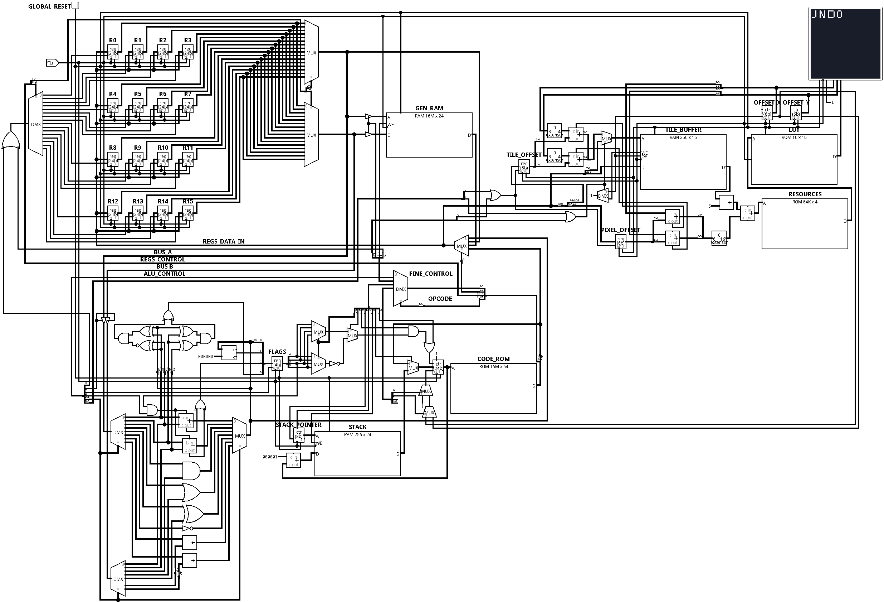

# CPU Details - Milo CPU

Versión: 1.0.0



## Introducción

Milo es un procesador de propósito general de 24 bits diseñado alrededor de una arquitectura basada en registros, una unidad de control cableada y un conjunto de coprocesadores especializados.

La CPU constituye el núcleo de procesamiento del ecosistema Milo y se comunica con otros subsistemas, como la GPU, mediante registros especiales mapeados por hardware.

Su diseño prioriza una organización sencilla del datapath, una implementación completamente cableada y una clara separación entre el lenguaje ensamblador (ISA) y la representación física ejecutada por el hardware.

Este documento describe exclusivamente la organización interna del procesador y los componentes que conforman la implementación actual.

## Especificaciones

Arquitectura:
- CPU de 24 bits

Banco de registros:
- 16 registros de propósito general (24 bits)

Program Counter:
- 24 bits

Stack Pointer:
- 8 bits de direcciones de 24 bits

Status Register:
- Flags N, Z, C y V

Unidad de control:
- Hardwired Control Unit

Modelo de memoria:
- ROM de instrucciones
- RAM de datos

Buses internos:
- Bus A
- Bus B
- Bus C

ALU:
- ADD
- ADC
- SUB
- SBC
- AND
- OR
- XOR
- NOT
- SHL
- SHR
- CMP

Control de flujo:
- JMP
- CALL
- RET
- WAITV
- Saltos condicionales basados en flags

Registros especiales:
- TBUF
- SCROLL

## Organización interna

### Banco de registros

El procesador dispone de un banco formado por dieciséis registros de propósito general, cada uno con un ancho de 32 bits.

No existe diferenciación entre registros dedicados y registros de propósito general. Todos los registros poseen exactamente las mismas capacidades y pueden emplearse indistintamente como origen o destino de una operación.

El banco de registros dispone de dos puertos de lectura independientes y un puerto de escritura lo que permite obtener dos operandos simultáneamente y escribir un resultado durante el mismo ciclo de ejecución.

Cada instrucción puede seleccionar simultáneamente:

- Un registro destino.
- Un primer registro fuente.
- Un segundo registro fuente.

Durante las operaciones de acceso a memoria, dos registros pueden asumir temporalmente las funciones equivalentes a MAR (Memory Address Register) y MDR (Memory Data Register). Esta funcionalidad se implementa mediante señales de control y no requiere registros especializados, reduciendo así la complejidad del hardware y aumentando la flexibilidad de la arquitectura.

---

### ALU

La Unidad Aritmético Lógica (ALU) constituye el bloque encargado de ejecutar las operaciones aritméticas, lógicas y de comparación del procesador.

Además de generar el resultado de la operación, la ALU puede actualizar el Status Register cuando la instrucción así lo solicita mediante el modificador `.F`.

Actualmente implementa:

- ADD
- ADC
- SUB
- SBC
- AND
- OR
- XOR
- NOT
- SHL
- SHR
- CMP

Las banderas disponibles son:

- Negative (N)
- Zero (Z)
- Carry (C)
- Overflow (V)

La actualización de dichas banderas es controlada completamente por la palabra de control generada por el compilador.

La ALU puede escribir tanto en registros de propósito general como en determinados registros especiales del sistema.

Actualmente la implementación permite actualizar registros pertenecientes al subsistema gráfico, como el registro de Scroll, utilizando exactamente las mismas operaciones aritméticas y lógicas disponibles para los registros convencionales.

---

### Status Register

El procesador incorpora un registro de estado encargado de almacenar el resultado de determinadas operaciones ejecutadas por la ALU.

Actualmente implementa cuatro banderas:

- N (Negative)
- Z (Zero)
- C (Carry)
- V (Overflow)

Estas banderas pueden actualizarse mediante las instrucciones que utilizan el modificador `.F` y posteriormente ser consultadas por las instrucciones de salto condicional.

De esta forma se desacopla el cálculo de una condición de la decisión de modificar el flujo de ejecución.

---

### Buses

El procesador utiliza una organización basada en tres buses internos que permiten desacoplar la lectura y escritura de datos durante la ejecución de una instrucción.

Esta organización permite obtener dos operandos simultáneamente y escribir un resultado en un mismo ciclo de ejecución, reduciendo la cantidad de transferencias necesarias dentro del datapath.

**Bus A:**

Transporta datos provenientes del banco de registros.

Usos:

- Primer operando de la ALU.
- MAR

**Bus B:**

- Segundo operando de la ALU.
- MDR

**Bus C:**

El resultado de la ALU o de otras fuentes es enviado mediante este bus al banco de registros.

> La utilización de tres buses permite leer simultáneamente dos operandos y escribir un resultado durante el mismo ciclo de ejecución.

---

### Unidad de Control

La unidad de control implementa una lógica cableada (Hardwired Control Unit).

Cada instrucción contiene un campo de operación (Opcode) encargado de seleccionar el bloque funcional que ejecutará la instrucción.

El opcode es enviado a un decodificador que habilita el bloque funcional correspondiente. Posteriormente, el campo de control fino de la instrucción es distribuido mediante lógica combinacional hacia el bloque seleccionado.

Este mecanismo permite generar directamente las señales necesarias para controlar:

- Banco de registros
- ALU
- Actualización del Status Register
- Program Counter
- Stack Pointer
- Acceso a RAM
- Selección de buses
- Control de flujo

La unidad de control no emplea memoria de microcódigo ni etapas adicionales de ejecución.

---

### Sistema de memoria

- ROM
- RAM

**Organización:**

A diferencia de una organización jerárquica tradicional donde las instrucciones atraviesan múltiples niveles de memoria antes de llegar al procesador:

```text
ROM
 ↓
RAM
 ↓
CPU
```

Milo utiliza una organización de memoria dividida:

```text
             ROM
              │
              ▼
        +-------------+
        |    CPU      |
        +-------------+
          ▲      ▲
          │      │
         RAM    GPU
```

La ROM se conecta directamente a la unidad de procesamiento y constituye la fuente de instrucciones del procesador.

La RAM se considera un recurso independiente destinado exclusivamente al almacenamiento de datos y es accedida mediante operaciones explícitas utilizando registros de propósito general.

Esta organización simplifica el datapath, reduce la lógica de control necesaria durante la búsqueda de instrucciones y desacopla completamente el flujo de instrucciones del acceso a datos.

> El Stack utilizado por CALL y RET forma parte del hardware del procesador y es administrado mediante el Stack Pointer y las señales de control del bloque Program Counter.

---

### Program Counter y Stack

El Program Counter (PC) almacena la dirección de la siguiente instrucción a ejecutar.

En condiciones normales el PC avanza secuencialmente una posición por ciclo.

Las instrucciones de control de flujo permiten modificar dicho comportamiento realizando saltos directos o cargando una dirección almacenada en el Stack.

El procesador incorpora además un Stack Pointer (SP) utilizado para implementar llamadas a subrutinas.

Actualmente se soportan las siguientes operaciones:

- CALL
- RET

CALL almacena automáticamente la dirección de retorno sobre el Stack y actualiza el Stack Pointer.

RET recupera dicha dirección y la carga nuevamente en el Program Counter.

WAITV permite detener temporalmente la ejecución de la CPU hasta que la GPU indique el inicio del período de Blank Vertical (Vertical Blank).

Esta instrucción facilita la sincronización entre CPU y GPU evitando modificaciones del estado gráfico durante el proceso de generación del cuadro.

### Registros especiales

Además del banco de registros de propósito general, la CPU dispone de un conjunto de registros especiales utilizados para controlar periféricos internos del sistema.

Actualmente se implementan:

#### SCROLL

Registro conectado a la GPU encargado de actualizar el desplazamiento horizontal y vertical del mapa de tiles.

Puede utilizarse como destino de operaciones MOV, MOVI y de instrucciones ejecutadas por la ALU.

#### TBUF

Registro utilizado para escribir datos directamente sobre el Tile Buffer de la GPU.

Cada escritura contiene tanto el índice del tile como la dirección donde será almacenado.

## Características relevantes actuales

Actualmente Milo implementa:

- Ejecución secuencial.
- Banco de 16 registros.
- CPU de 24 bits.
- Program Counter de 24 bits.
- ALU completa.
- Status Register.
- Saltos.
- CALL / RET.
- LOAD / STORE.
- Registros especiales.
- Comunicación CPU-GPU.
- Tile Buffer.
- Scroll por hardware.
- WAITV.
- Unidad de control cableada.

Actualmente aún no incorpora:

- Interrupciones.
- DMA.
- OAM.
- Audio.
- Caché.
- MMU.
- Pipeline.
- Predicción de saltos.

> **Nota**
>
> Hasta la versión 0.1 Milo utilizó una arquitectura de 32 bits.
> A partir de la versión 1.0.0 la arquitectura fue rediseñada sobre un datapath de 24 bits con el objetivo de optimizar el uso de recursos en FPGA y reducir la complejidad del hardware, manteniendo la filosofía del ISA y del compilador.