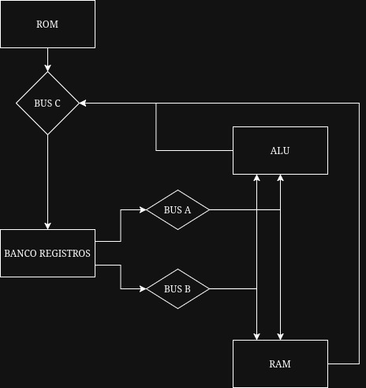

# CPU Details - Milo CPU
Versión: Alpha 0.1


## Introducción

Milo Alpha es un procesador de propósito general de 32 bits diseñado alrededor de una arquitectura de registros con unidad de control cableada. Su diseño prioriza una organización sencilla del datapath y una separación clara entre la memoria de instrucciones y la memoria de datos.

La implementación actual constituye el núcleo funcional de la arquitectura e incorpora los componentes mínimos necesarios para ejecutar instrucciones, realizar operaciones aritméticas y lógicas, y acceder a memoria mediante registros de propósito general.

Este documento describe exclusivamente la organización interna del procesador y los componentes que conforman la implementación actual.

## Especificaciones

Arquitectura: 32 bits

Banco de registros: 16 registros

Ancho de registros: 32 bits

Unidad de control: Cableada (Hardwired)

Modelo de memoria:
- ROM para instrucciones (32 bits) y datos inmediatos (32 bits)
- RAM para datos (32 bits)

Buses internos: 3
- 2 de escritura general
- 1 de escritura hacia banco registros

ALU:
- ADD
- SUB
- AND
- OR
- XOR
- NOT
- SHIFT

Flags:
- N
- Z
- C
- O

## Organización interna



### Banco de registros

El procesador dispone de un banco formado por dieciséis registros de propósito general, cada uno con un ancho de 32 bits.

No existe diferenciación entre registros dedicados y registros de propósito general. Todos los registros poseen exactamente las mismas capacidades y pueden emplearse indistintamente como origen o destino de una operación.

El banco de registros dispone de dos puertos de lectura independientes y un puerto de escritura lo que permite obtener dos operandos simultáneamente y escribir un resultado durante el mismo ciclo de ejecución.

Cada instrucción puede seleccionar simultáneamente:

- Un registro destino.
- Un primer registro fuente.
- Un segundo registro fuente.

Durante las operaciones de acceso a memoria, dos registros pueden asumir temporalmente las funciones equivalentes a MAR (Memory Address Register) y MDR (Memory Data Register). Esta funcionalidad se implementa mediante señales de control y no requiere registros especializados, reduciendo así la complejidad del hardware y aumentando la flexibilidad de la arquitectura.

---

### ALU

La Unidad Aritmético Lógica (ALU) constituye el bloque encargado de ejecutar las operaciones matemáticas y lógicas del procesador.

La ALU recibe simultáneamente dos operandos provenientes de los buses A y B.

Actualmente implementa las siguientes operaciones:

- ADD
- SUB
- AND
- OR
- XOR
- NOT
- SHIFT LEFT
- SHIFT RIGHT

La operación ejecutada y el uso de las banderas N, Z, C y O (actualizacion o uso) es determinado por la unidad de control mediante el campo de control fino de la instrucción

El resultado generado es colocado sobre el Bus C para su posible escritura en el banco de registros.

---

### Buses

El procesador utiliza una organización basada en tres buses internos que permiten desacoplar la lectura y escritura de datos durante la ejecución de una instrucción.

Esta organización permite obtener dos operandos simultáneamente y escribir un resultado en un mismo ciclo de ejecución, reduciendo la cantidad de transferencias necesarias dentro del datapath.

**Bus A:**

Transporta datos provenientes del banco de registros.

Usos:

- Primer operando de la ALU.
- MAR

**Bus B:**

- Segundo operando de la ALU.
- MDR

**Bus C:**

El resultado de la ALU o de otras fuentes es enviado mediante este bus al banco de registros.

> La utilización de tres buses permite leer simultáneamente dos operandos y escribir un resultado durante el mismo ciclo de ejecución.

---

### Unidad de Control

La unidad de control implementa una lógica cableada (Hardwired Control Unit).

Cada instrucción contiene un opcode de seis bits que identifica la operación principal a ejecutar.

El opcode es enviado a un decodificador que habilita el bloque funcional correspondiente. Posteriormente, el campo de control fino de la instrucción es distribuido mediante lógica combinacional hacia el bloque seleccionado.

Este mecanismo permite que una única instrucción genere directamente las señales necesarias para controlar:

- Banco de registros.
- ALU.
- Acceso a memoria.
- Actualización de banderas.
- Movimiento de datos.

La unidad de control no emplea memoria de microcódigo ni etapas adicionales de ejecución.

---

### Sistema de memoria

- ROM
- RAM

**Organización:**

A diferencia de una organización jerárquica tradicional donde las instrucciones atraviesan múltiples niveles de memoria antes de llegar al procesador:

```text
ROM
 ↓
RAM
 ↓
CPU
```

Milo utiliza una organización de memoria dividida:

```text
             ROM
              │
              │
      Instrucciones
              │
              ▼
+---------------------------+
|           CPU             |
|                           |
| Banco de Registros        |
| ALU                       |
| Unidad de Control         |
+---------------------------+
              ▲
              │
      Datos mediante operaciones 
      LOAD/STORE + bits de control fino
              │
             RAM
```

La ROM se conecta directamente a la unidad de procesamiento y constituye la fuente de instrucciones del procesador.

La RAM se considera un recurso independiente destinado exclusivamente al almacenamiento de datos y es accedida mediante operaciones explícitas utilizando registros de propósito general.

Esta organización simplifica el datapath, reduce la lógica de control necesaria durante la búsqueda de instrucciones y desacopla completamente el flujo de instrucciones del acceso a datos.

## Características Relevantes Actuales

Program Counter es lineal.

No existen interrupciones.

No existe caché.

No existe MMU.

No existe pipeline.

No existe predictor de saltos.

No existe DMA.

No existe GPU.

No existe APU.