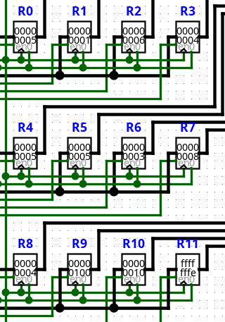

# Test ALU

El test ALU verifica la generación de código para las instrucciones aritméticas y lógicas implementadas por la Unidad Aritmético-Lógica (ALU) de Milo Alpha.

Su objetivo principal consiste en comprobar que el compilador traduzca correctamente cada operación del ISA hacia la palabra de control correspondiente, seleccionando la operación de la ALU, los registros involucrados y las señales de control necesarias para su ejecución.

## Escenarios cubiertos

Actualmente la prueba verifica:

- Operaciones de suma (`ADD`).
- Operaciones de resta (`SUB`).
- Operaciones lógicas (`AND`, `OR`, `XOR`).
- Desplazamientos lógicos (`SHL`, `SHR`).
- Operaciones unarias (`NOT`).
- Codificación de múltiples registros fuente y destino.
- Generación correcta de la palabra de control para cada operación.

El programa utilizado durante la prueba es el siguiente:

```text
MOVI R0, #5
MOVI R1, #1

ADD R2, R0 R1
SUB R3, R0 R1

AND R4, R0 R0
OR  R5, R0 R1
XOR R6, R0 R2

MOVI R7, #8
MOVI R8, #4

SHL R9, R1 R7
SHR R10, R9 R8

NOT R11, R1
```

Las instrucciones `MOVI` únicamente inicializan los registros necesarios para ejecutar posteriormente las operaciones de la ALU.

## Resultado esperado

La compilación debe finalizar sin errores y generar el archivo:

`compilaciones/test_alu.txt`

Cada instrucción debe producir una palabra de control cuya selección de operación, registros y señales de control corresponda exactamente con la especificación del Instruction Encoding.

Posteriormente, el archivo puede cargarse en la ROM del circuito `CPU.circ` para verificar el comportamiento físico del procesador.

Tras la ejecución completa del programa, el contenido esperado del banco de registros es:



Este resultado puede comprobarse visualmente ejecutando el programa sobre el circuito CPU.circ.