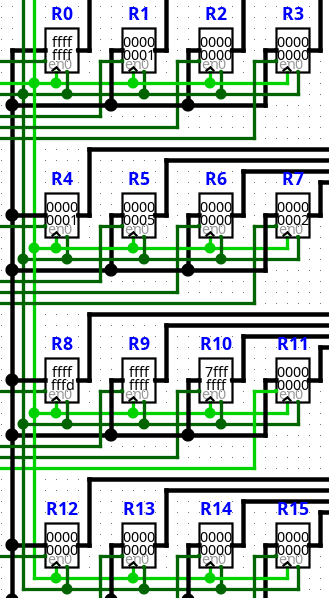
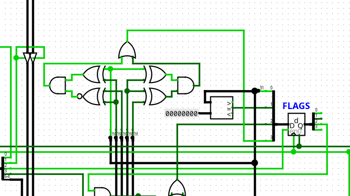

# Test FLAGS

El test FLAGS verifica la generación de código para las instrucciones que actualizan el registro de banderas (Status Register) del procesador.

Su objetivo principal consiste en comprobar que el compilador genere correctamente las señales de control asociadas a la actualización de las banderas y que el hardware produzca el estado esperado tras ejecutar operaciones aritméticas específicas.

## Escenarios cubiertos

Actualmente la prueba verifica:

Actualización de la bandera **Carry (C)**.
Propagación del acarreo mediante `ADC`.
Actualización de la bandera **Zero (Z)**.
Actualización de la bandera **Negative (N)**.
Uso del acarreo en operaciones `SBC`.
Actualización de la bandera **Overflow (V)**.
Funcionamiento del modificador `.F`, encargado de habilitar la actualización de las banderas.

El programa utilizado durante la prueba es el siguiente:

```text
; --- Carry ---
MOVI R0, #4294967295    ; Carga 0xFFFFFFFF\n"
MOVI R1, #1
ADD.F R2, R0 R1         ; 0xFFFFFFFF + 1 = 0x00000000 (Genera Carry = 1)

; --- ADC ---
ADC R4, R3 R3           ; R4 = 0x00000001

; --- Zero ---
MOVI R5, #5
SUB.F R6, R5 R5         ; 5 - 5 = 0 (Genera Zero = 1)

; --- Negative ---
MOVI R7, #2
SUB.F R8, R7 R5         ; 2 - 5 = 0xFFFFFFFD / -3 (Genera Negative = 1)

; --- SBC ---
SBC R9, R3 R3           ; R9 = 0xFFFFFFFF

; --- Overflow ---
MOVI R10, #2147483647   ; Carga 0x7FFFFFFF
ADD.F R11, R10 R1       ; 0x7FFFFFFF + 1 = 0x80000000 (Overflow = 1)
```

Cada bloque del programa está diseñado para provocar una condición específica sobre el registro de banderas del procesador.

## Resultado esperado

La compilación debe finalizar sin errores y generar el archivo:

`compilaciones/test_flags.txt`

El archivo generado puede cargarse posteriormente en la ROM del circuito `CPU.circ` para verificar el comportamiento físico del procesador.

Durante la ejecución deben observarse los siguientes resultados anteriormente comentados adicionalmente que el banco de registros debe verse de la siguiente manera:



Y durante la ultima instruccion overflow debe estar activo:

