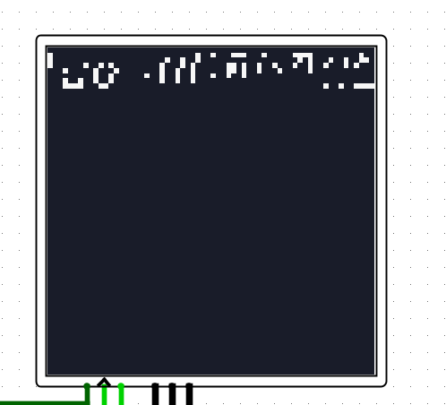
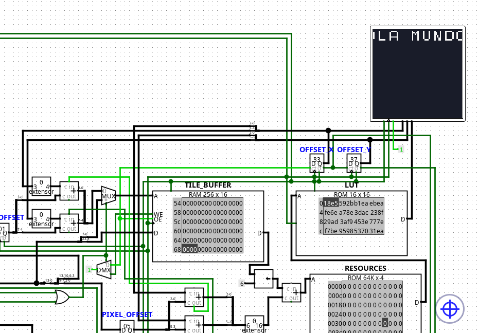

# Test GPU

El test GPU verifica la comunicación entre la CPU y la Unidad de Procesamiento Gráfico (GPU) de Milo.

Su objetivo consiste en comprobar que el compilador genere correctamente las palabras de control necesarias para escribir sobre los registros especiales de la GPU y validar la sincronización entre ambos procesadores mediante la instrucción `WAITV`.

La prueba también permite verificar el funcionamiento del Tile Buffer, el registro de Scroll y el mecanismo de sincronización durante el período de Vertical Blank.

## Escenarios cubiertos

Actualmente la prueba verifica:

- Escritura sobre el Tile Buffer mediante el registro especial `TBUF`.
- Actualización del registro de Scroll mediante operaciones de la ALU.
- Sincronización CPU-GPU utilizando `WAITV`.
- Funcionamiento del registro `SCROLL`.
- Escritura secuencial de tiles en memoria de video.
- Actualización continua del desplazamiento horizontal.
- Ejecución de un bucle de animación sincronizado con Vertical Blank.

El programa utilizado durante la prueba es el siguiente:

```text
; ---- Escritura de 'HOLA MUNDO' en Tile Buffer ----

MOVI TBUF, #2048
MOVI TBUF, #3841
MOVI TBUF, #3074
MOVI TBUF, #259
MOVI TBUF, #4
MOVI TBUF, #3333
MOVI TBUF, #5382
MOVI TBUF, #3591
MOVI TBUF, #1032
MOVI TBUF, #3849

; ---- Configuración del Scroll ----

MOVI R0, #1
MOVI R2, #127
MOVI R1, #0

; ---- Animación ----

WAITV
ADD SCROLL, R1, R1, R0
CMP R1, R2
JZ #12
JMP #13
```

Las primeras instrucciones escriben el mensaje **"HOLA MUNDO"** dentro del Tile Buffer de la GPU.

Posteriormente se inicializan los registros utilizados para controlar el desplazamiento horizontal del mapa.

Finalmente, el programa entra en un ciclo infinito donde espera el inicio del período de Vertical Blank antes de actualizar el registro `SCROLL`, garantizando que la modificación del desplazamiento ocurra únicamente entre cuadros y evitando artefactos visuales durante el barrido de la pantalla. Aqui un ejemplo:



## Resultado esperado

La compilación debe finalizar sin errores y generar el archivo:

`compilaciones/test_gpu.txt`

Cada instrucción debe producir la palabra de control correspondiente para:

- Escritura sobre `TBUF`.
- Escritura sobre `SCROLL`.
- Espera mediante `WAITV`.
- Comparación mediante `CMP`.
- Control del flujo utilizando `JZ` y `JMP`.

Posteriormente el programa puede cargarse en la ROM del circuito de la CPU junto con la GPU implementada en Logisim Evolution.

Tras iniciar la simulación debe observarse el siguiente comportamiento:



- El mensaje **"HOLA MUNDO"** aparece correctamente escrito en el Tile Buffer.
- La GPU genera la imagen utilizando los tiles almacenados.
- El desplazamiento horizontal aumenta de forma progresiva.
- Cada actualización del Scroll ocurre únicamente durante Vertical Blank.
- No deben observarse artefactos gráficos ("tearing") durante el desplazamiento.

Este test constituye la primera prueba de integración entre la CPU y la GPU del ecosistema Milo.