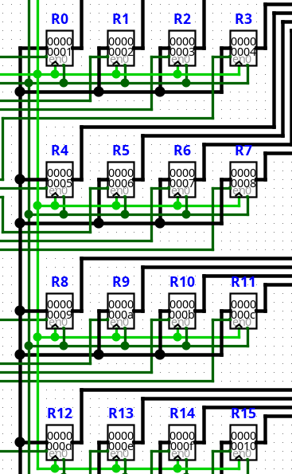

# Test MOVI

El test **MOVI** verifica la generación de código para las instrucciones de carga inmediata del ISA.

Su objetivo principal consiste en comprobar que el compilador codifique correctamente el registro destino y el valor inmediato almacenado en la palabra de datos de la ROM.

## Escenarios cubiertos

Actualmente la prueba verifica:

- Codificación de todos los registros de propósito general (R0–R15).
- Generación de distintos valores inmediatos.
- Traducción correcta hacia el formato físico de la ROM.
- Exportación del programa compilado.

Para ello, el programa genera automáticamente una instrucción `MOVI` para cada registro disponible de la arquitectura.

```text
MOVI R0, #1
MOVI R1, #2
...
MOVI R15, #16
```

## Resultado esperado

La compilación debe finalizar sin errores y generar el archivo:

`compilaciones/instrucciones/test_movi.txt`

Cada instrucción compilada produce una palabra de control y un valor inmediato que posteriormente pueden verificarse subiendo el txt a la ROM en el circuito de logisim `CPU.circ`

Despues de que el cpu ejecute las instrucciones el resultado esperado deberia ser:

