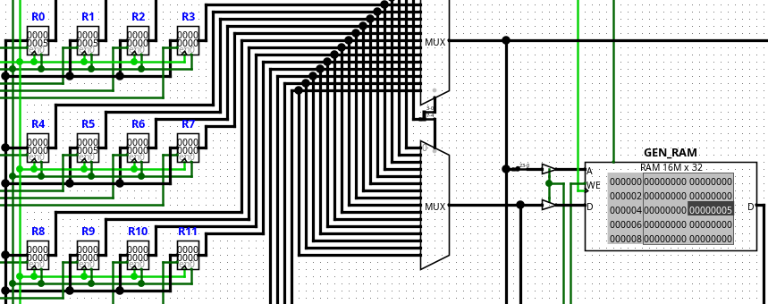

# Test Movimiento General

El test **Movimiento General** verifica la correcta generación de código para las instrucciones de transferencia de datos entre registros y memoria.

Estas instrucciones representan las operaciones básicas utilizadas para mover información dentro de la arquitectura Milo Alpha.

## Escenarios cubiertos

Actualmente la prueba incluye las siguientes instrucciones:

```text
MOVI R0, #5
MOV  R1, R0
STORE R0, [R0]
LOAD  R5, [R0]
```

Con esta secuencia se valida:

- Carga de valores inmediatos mediante `MOVI`.
- Transferencia entre registros mediante `MOV`.
- Escritura en memoria mediante `STORE`.
- Lectura desde memoria mediante `LOAD`.

Cada una de estas instrucciones utiliza rutas de datos diferentes dentro del procesador, por lo que el test permite comprobar la correcta selección de buses, registros y señales de control durante la generación del código.

## Resultado esperado

La compilación debe finalizar correctamente y generar el archivo:

`compilaciones/instrucciones/test_movimiento_general.txt`

Cada instrucción compilada produce una palabra de control y un valor inmediato que posteriormente pueden verificarse subiendo el txt a la ROM en el circuito de logisim `CPU.circ`

Despues de que el cpu ejecute las instrucciones el resultado esperado deberia ser:

