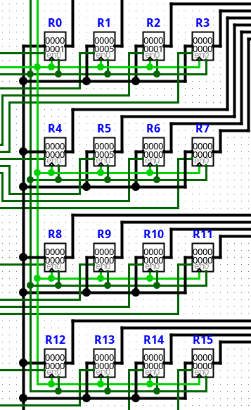

# Test Program Counter

El test **Program Counter** verifica la generación de código para las instrucciones encargadas del control de flujo del programa.

Su objetivo principal consiste en comprobar que el compilador genere correctamente la codificación de las instrucciones que modifican el Program Counter y que el hardware ejecute adecuadamente los cambios de flujo mediante saltos, llamadas a subrutinas y retornos.

## Escenarios cubiertos

Actualmente la prueba verifica:

- Instrucción `CMP` para la actualización del registro de banderas.
- Saltos condicionales mediante `JZ`, `JNZ` y `JC`.
- Salto incondicional mediante `JMP`.
- Llamadas a subrutinas mediante `CALL`.
- Retorno desde subrutinas mediante `RET`.
- Funcionamiento del Program Counter durante cambios de flujo.
- Funcionamiento del Stack durante las operaciones `CALL` y `RET`.

El programa utilizado durante la prueba es el siguiente:

```text
JMP MAIN ; Saltar sobre la función

;-------------------------
; Función sumar
;-------------------------
SUMAR: ; while (R1 == 5)

BUCLE:
    CMP R1, R5      ; R5 contiene 5
    JZ FIN_FUNCION

    ADD R1, R1 R0
    JMP BUCLE

FIN_FUNCION:
    RET

;-------------------------
; Programa principal
;-------------------------
MAIN:

MOVI R0, #1
MOVI R1, #0
MOVI R5, #5

CALL SUMAR

CMP R1, R5
JZ IGUALES

MOVI R2, #2
JMP FIN

IGUALES:
MOVI R2, #1

FIN:
NOP
```

El programa simula un flujo de ejecución sencillo compuesto por una fase de inicialización, una comparación entre registros, una bifurcación condicional, la ejecución de una subrutina y el retorno al programa principal antes de finalizar.

## Resultado esperado

La compilación debe finalizar sin errores y generar el archivo:

`compilaciones/test_pc.txt`

El archivo generado puede cargarse posteriormente en la ROM del circuito `CPU.circ` para verificar el comportamiento físico del procesador.

Durante la ejecución debe observarse que:

- `CMP` actualiza correctamente el registro de banderas.
- `JZ` transfiere el control al bloque de subrutinas al cumplirse la condición de igualdad.
- `CALL` almacena la dirección de retorno en el Stack y transfiere la ejecución a la subrutina.
- `RET` recupera la dirección almacenada previamente y retorna al programa principal.
- `JMP` evita que la ejecución vuelva a entrar en la subrutina.
- El programa finaliza ejecutando la instrucción `NOP`.

El banco de registros, el Program Counter y el Stack deben reflejar el recorrido esperado del flujo de ejecución durante toda la prueba.

